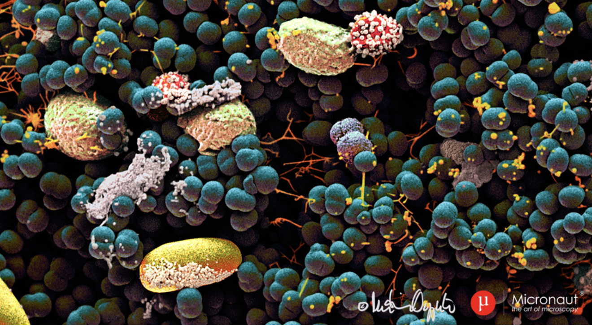
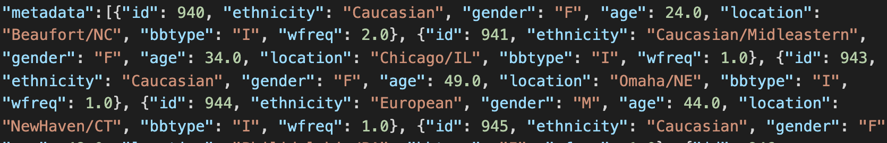
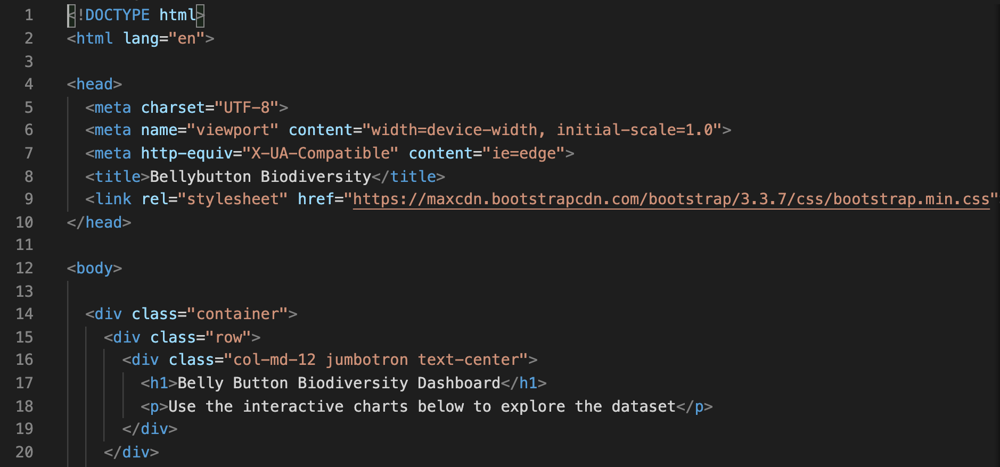
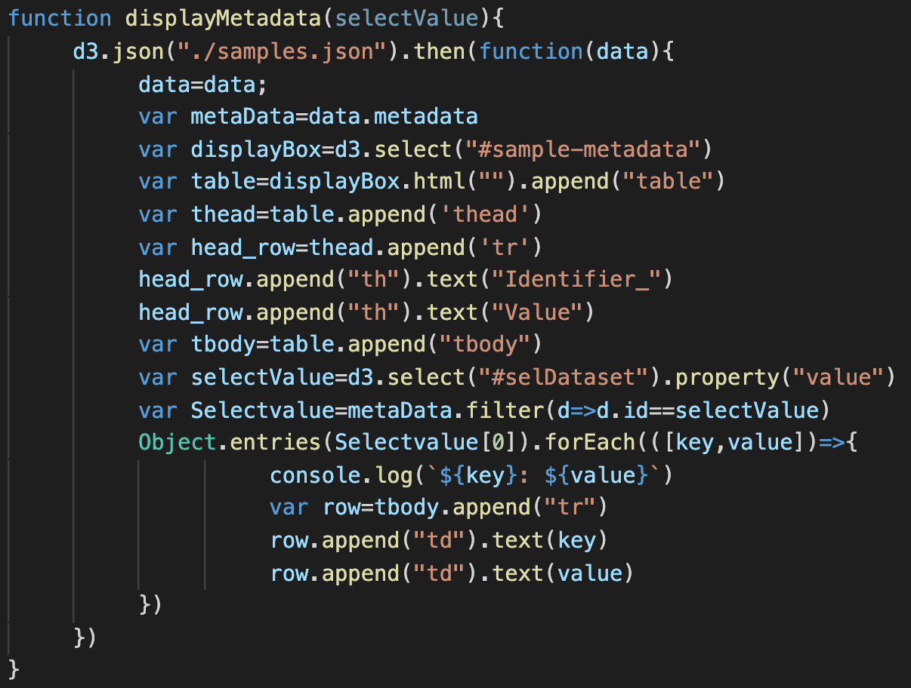
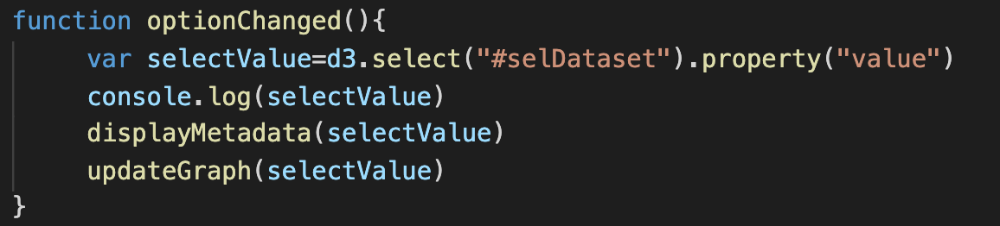

# Belly Button Biodiversity (Plot.ly)

## Step 1: Project description

The purpose of this project is to present the Biodiversity of Belly Button with D3 which created an interactive dashboard for people who want to learn about the bacteria in Belly Button. Using resource [Belly Button Biodiversity dataset](http://robdunnlab.com/projects/belly-button-biodiversity/), which catalogs the microbes that colonize human navels.

## Tools Used 

1. Javascript 
2. HTML/CSS

## Link to the visualization

* will be available shortly 

#steps 
1. Download file from [robdunnlab](http://robdunnlab.com/projects/belly-button-biodiversity/results-and-data/) and transform the data type to json file.

2. Use of Javascript to read json file. 

3. Plan out the possible interactive charts and/or dashboard.

* horizontal bar chart with a dropdown menu to display the top 10 OTUs found in that individual.
  * `sample_values` as the values,`otu_ids` as the labels, and `otu_labels` as the hovertext for the bar chart
  
* bubble chart to displays all samples across the chart
  * `otu_ids` for the x values and `sample_values` for the y values
  * `sample_values` for the marker size, `otu_ids` for the marker colors, and`otu_labels` for the text values.
* table to display an individual's demographic information.

* Set up the initial view by placing the first set of value in init function

* Button set outside of the function

* Set different charts along with `forEach`,`.append`, `.text`,`.propery` etc

4. Create a HTML and create positions for charts 
 
* file stage
 index.html
 static/js/app.js

## Analysis 

While exploring different sets of bacterias across different people, we can only see how certain bacteria are more frequently appear in the list. This interactive dashboard is a great starting point for me to work with in wanting to design some educational dashboard where people could select through different animals or plant that they want to learn.

